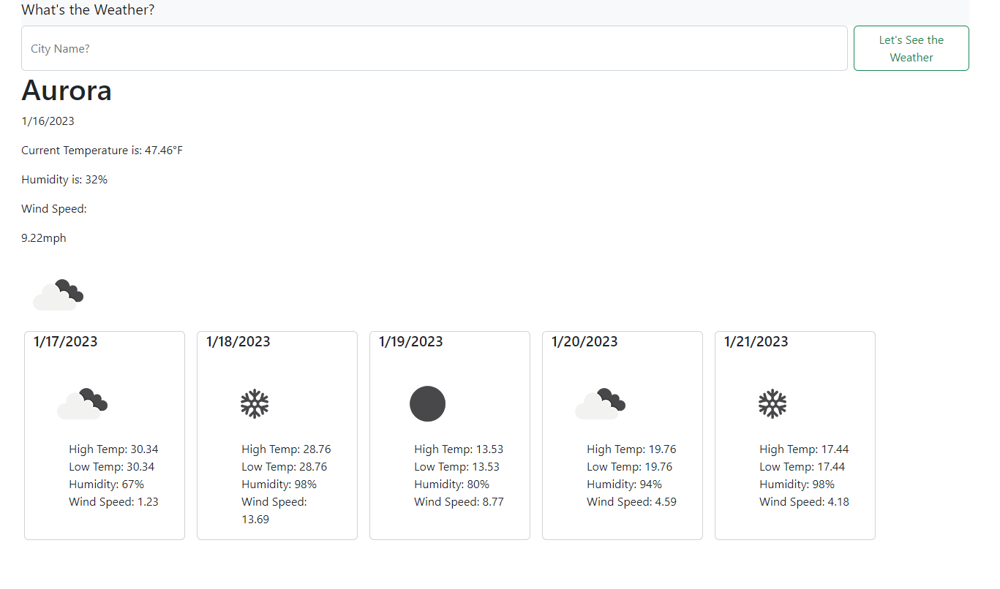

# Weather Dashboard

## Description

Ever gone on vacation only to find out that you were underprepared for the weather? This application will limit that from happening, as the User can type any city name and a 5 day forecast will be displayed for that city. In this project, I learned how to use the OpenWeather API to populate specific information into dynamically generated weather cards.

## Installation

There should be no extra steps to install this application

## Usage

Just input the city name that you want to get a 5 day forecast for, then the application should do the rest!

## Deployed Site URL

https://artiecannv.github.io/weather-dashboard/

## Credits

Worked with my tutor, Andrew Tirpok to get this project functional.